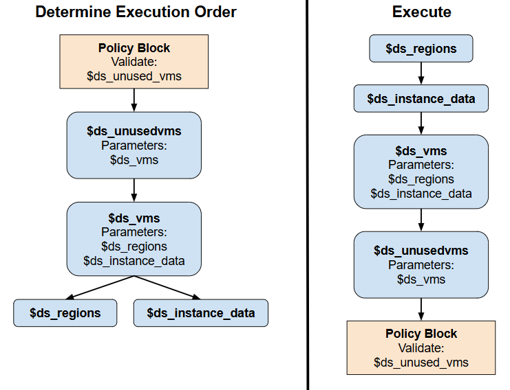

# Flexera Policy Development - Lesson 01 - Introduction

This lesson won't involve any development and is intended to provide a general overview of what policy templates are and how they work.

Please note that this is only a summary. We recommended that you also read the [official documentation on policy templates](https://docs.flexera.com/flexera/EN/Automation/AboutPolicies.htm) for a general overview.

## The Basics

A *policy template* is a text file written in the [Policy Template Language](https://docs.flexera.com/flexera/EN/Automation/PTL.htm). When a policy template is executed by the policy engine, the policy engine connects to various APIs to gather data, analyzes that data, and then raises an incident if a problem is found. The [Cloud Workflow Language](https://docs.flexera.com/flexera/EN/Automation/CWL.htm) is also supported for taking automatic action to resolve incidents; for example, deleting unused or unnecessary resources in a cloud environment.

A large collection of pre-written policy templates are available in the [Policy Catalog](https://docs.flexera.com/flexera/EN/Automation/PoliciesList.htm) in the Automation → Catalog section of the Flexera One website. Users can also upload their own policy templates in the Automation → Templates section.

An *applied policy* is an instance of a policy template that has been applied and runs on a regular frequency, raising incidents if a problem is detected. Because policy templates can take parameters to configure how they work when they are applied, it is common for the same policy template to be applied more than once, hence the need to distinguish between policy templates and applied policies. Applied Policies can be found in the Automation → Applied Policies section of the Flexera One website.

An *incident* is a collection of data, usually presented as a table, that is presented if a policy template detects a problem. For example, if you applied a policy template to look for virtual machines that are powered off, said applied policy would raise an incident with a list of problematic virtual machines if any were found. Incidents are visible on the Flexera One website in the Automation → Incidents section. Most policy templates can also email the incident to a set of email addresses.

A *credential* is an API key, API token, username/password, or other information used to authenticate to an API that is stored in the Flexera platform. For example, if the above mentioned policy template for stopped virtual machines is an AWS policy template, you would need to select a valid AWS credential when applying the policy template. This enables the policy engine to connect to your AWS account and obtain a list of virtual machines and their status. Credentials can be found in the Automation → Credentials section of the Flexera One website.

## The Policy Template Language

The [Policy Template Language](https://docs.flexera.com/flexera/EN/Automation/PTL.htm) is a domain-specific language (DSL) designed to simplify automation by providing a straight-forward, human readable language focused on the specific function policy templates serve instead of relying on existing broad-use programming languages.

* The basic structure of the language resembles Ruby, with code organized into do-end blocks. It is not Ruby-based, and arbitrary Ruby code is not supported. That said, the superficial similarity to Ruby means that you can choose "Ruby" in your favorite code editor to ensure that policy code is colored correctly.

* Blocks of JavaScript code can be used on an as-needed basis to refine, manipulate, and combine data gathered from APIs.

## Basic Structure of a Policy Template

A policy template will broadly follow the following structure:

1. Metadata that describes the policy template.
2. Parameters that the end user can set values for when applying the policy template.
3. Credentials that enable the policy template to authenticate to various APIs.
4. Datasources that connect to those APIs to gather data or execute blocks of JavaScript code to process, manipulate, combine, or filter data.
5. A policy block that will assess one or more datasources and will raise incidents if a problem is found.
6. Escalation block(s) that will take various actions on resources listed within incidents.

For example, suppose you wanted to write a policy template that reported on unused virtual machines. Following the same structure above:

1. Metadata would contain a name and description indicating that this policy template reports on unused VMs.
2. Parameters would enable the user to only report VMs in certain cloud accounts, set thresholds for how low CPU or memory usage needs to be to consider a VM to be unused, etc.
3. Credentials would enable the user to select credentials in the Flexera platform so that the policy template can authenticate to APIs in the cloud provider.
4. Datasources would gather and process all of the necessary data from the cloud provider's APIs to produce a list of VMs along with the metadata about those VMs needed to determine if they are unused.
5. The policy block would assess the datasource containing the final list of VMs and raise an incident if it contains unused VMs. The incident would only contain the unused VMs.
6. Escalation blocks would enable the incident to be emailed as well as enable the user to delete unused VMs within the Flexera One website.

A policy template does not necessarily execute in the order in which it is written. The policy engine will look at the policy block to find the datasource(s) that will be assessed, and then will work backwards to find the various other datasources it will need to create that final datasource(s). It will then create an execution flow that will ensure that no datasource executes unless the datasources it depends on have already executed. Finally, it will execute everything in the appropriate order.

This should be enough for us to dive into developing a very simple policy template. Please proceed to [Lesson 02](https://github.com/flexera-public/policy_engine_training/blob/main/lessons/02_hello_world/README.md).
